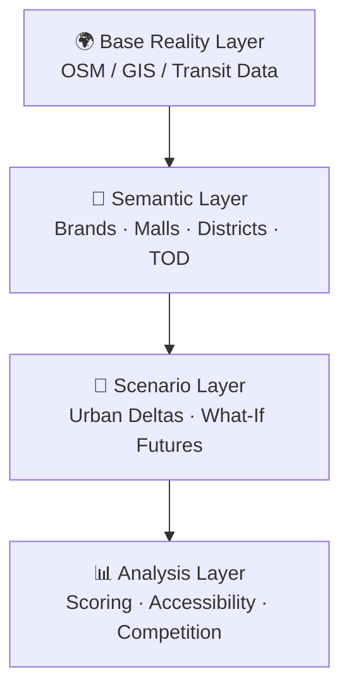

# 🏙️ DRMD — Semantic Urban Scenario Simulation

<p align="center">
  <strong>Explore how cities <em>could</em> evolve — not just how they look today.</strong>
</p>

<p align="center">
  
  
  
  
</p>

---

## 📖 What is DRMD?

DRMD is an **experimental platform** for semantic urban scenario simulation. Instead of treating cities as static geometry, it treats them as **dynamic, interconnected systems**.

> A new mall is not just a polygon. A new subway line is not just a line string. They reshape human movement, commercial gravity, spatial hierarchy, accessibility, competitive relationships — and future possibilities.

| Traditional GIS | DRMD |
|:--|:--|
| "What exists?" | "What could happen?" |
| Static geometry | Dynamic relationships |
| Single reality | Scenario branching |
| Map rendering | Semantic reasoning |

---

## 🧠 Philosophy

### 🪶 Lightweight over Photorealistic

We intentionally avoid heavy digital twin pipelines, TB-scale 3D city models, and excessive rendering. The stack focuses on **GeoJSON + vector tiles + semantic overlays + graph relationships**.

### 🔗 Semantic-First

Cities are **relationships, influence, hierarchy, and evolution** — not just geometry. DRMD prioritizes meaning, connections, context, and change over time.

### 🗺️ Local Worlds

Not designed to simulate entire countries. Instead, focus on **high-detail local urban systems**: a CBD, a transit corridor, a commercial district, or an alternate future city.

### 🎲 Possibility over Prediction

Cities are chaotic systems — policies change, economies shift, human preferences evolve. DRMD explores **plausible outcomes, structural tendencies, and spatial tradeoffs**, not deterministic predictions.

---

## 🏗️ Four-Layer Architecture



| Layer | Description |
|:--|:--|
| **🌍 Base Reality** | Imported from OSM, public GIS data, transit networks — the baseline |
| **🧩 Semantic** | Enrich geometry with meaning: brand relationships, commercial positioning, TOD connectivity, crowd attraction |
| **🔀 Scenario** | *Core layer!* Create "what-if" urban futures: new metro, old industrial → mixed-use, future CBD |
| **📊 Analysis** | Evaluate cascading effects: accessibility, commercial gravity, competitive landscape |

---

## 🚀 Quick Start

### Prerequisites

- [Node.js](https://nodejs.org/) ≥ 18
- [Docker](https://www.docker.com/) (for PostgreSQL + PostGIS)
- npm ≥ 9

### 1. Clone & Install

```bash
git clone https://github.com/dmc-forwardtogether/DRMD.git
cd drmd
npm install
```

### 2. Start Database

```bash
docker-compose up -d
```

This starts **PostgreSQL 16 + PostGIS 3.4** on port `5433`.

### 3. Start the App

```bash
# Terminal 1: Express API server (port 8899)
cd apps/server && npx tsx src/index.ts

# Terminal 2: Nuxt dev server (port 3000)
cd apps/web && npx nuxi dev
```

Or use the convenience script:

```bash
npm run dev
```

### 4. Open

Navigate to **http://localhost:3000** 🎉

| Service | Port | Description |
|:--|:--|:--|
| 🖥️ Nuxt Web | `3000` | Map editor & dashboards |
| ⚙️ Express API | `8899` | REST API & business logic |
| 🗄️ PostGIS | `5433` | Spatial database |

---

## 📂 Project Structure

```
drmd/
├── apps/
│   ├── server/          # Express API + PostGIS
│   │   ├── migrations/  # SQL schema & seed data
│   │   └── src/
│   │       ├── routes/  # API endpoints
│   │       └── services/# Business logic (Amap, Graph)
│   └── web/             # Nuxt 3 frontend
│       ├── components/  # MapEditor, FeaturePanel, DrawToolbar...
│       ├── pages/       # index (map), buildings, commercial
│       ├── store/       # Pinia editor state
│       └── types/       # TypeScript definitions
├── packages/
│   └── shared-types/    # Shared type definitions
├── docker-compose.yml   # PostGIS container
└── docs/                # Architecture & roadmap
```

---

## 🗄️ Database Schema (Core Tables)

| Table | Description |
|:--|:--|
| `projects` | Project containers (SRID, metadata) |
| `features` | GeoJSON features with PostGIS geometry |
| `structures` | Buildings/structures (CTI root: mall, road, school, park...) |
| `entities` | Organizations (enterprise, government, institution) |
| `brands` | Brands linked to entities (owner/customer/both) |
| `parcel_structures` | M:N parcel ↔ building relationships |
| `structure_scores` | CTI scoring base + subtype score tables |
| `building_scores` | Aggregated building-level scores |
| `road_nodes` / `road_edges` | Road network graph |

See [`apps/server/migrations/`](apps/server/migrations/) for the full schema.

---

## 🎯 MVP v0.0.1 (Current)

### ✅ In Scope
- 🗺️ GeoJSON parcel drawing + property editing
- 🏢 Structure CRUD + brand association + parent-child hierarchy
- 🏬 Commercial center (brand management + scoring + shop association)
- 🛣️ Road network graph theory
- 📍 Amap POI import
- ⭐ Brand scoring (3 dimensions, 1-10)

### 🔜 Coming (v0.1.0+)
- 🔀 Scenario branching system
- ⏱️ Timeline / temporal simulation
- 🏘️ Residential / 🏭 Industrial / 🏫 School parcel types
- 📊 Multi-model analysis plugins

See [docs/roadmap.md](docs/roadmap.md) for full version plan.

---

## 🛠️ Tech Stack

| Layer | Technology |
|:--|:--|
| 🗄️ Database | PostgreSQL 16 + PostGIS 3.4 |
| ⚙️ Backend | Express 4 + TypeScript |
| 🖥️ Frontend | Nuxt 3 + Vue 3 + TypeScript |
| 🗺️ Map | MapLibre GL JS + @mapbox/mapbox-gl-draw |
| 📐 Spatial | Turf.js + GeoJSON |
| 🎨 Styles | Tailwind CSS + Lucide Icons |
| 🐳 Infra | Docker Compose |

---

## 🤝 Contributing

This is an early-stage MVP. Contributions, ideas, and feedback are welcome!

1. Fork the repository
2. Create your feature branch (`git checkout -b feature/amazing-feature`)
3. Commit your changes (`git commit -m 'Add amazing feature'`)
4. Push to the branch (`git push origin feature/amazing-feature`)
5. Open a Pull Request

---

## 📄 License

MIT © DRMD Contributors — see [LICENSE](LICENSE) for details.

---

<p align="center">
  <sub>Built with ❤️ for urban thinkers, city planners, and possibility explorers.</sub>
</p>
